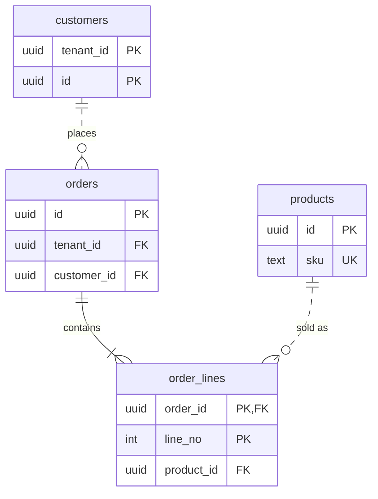

# Mermaid ERD

The Model section of the database design doc holds one `erDiagram`: entities, keys and cardinality. Columns live in the DDL, so list only key columns.

The cardinality glyph nearest an entity describes that entity's side. A solid line (`--`) is an identifying relationship (the parent key is part of the child's key, as in `order_lines`); a dotted line (`..`) is non-identifying.

Key types match the DDL; markers `PK`, `FK`, `UK` combine with commas. Past about 15 tables, draw one diagram per bounded context plus one of the cross-context links.
